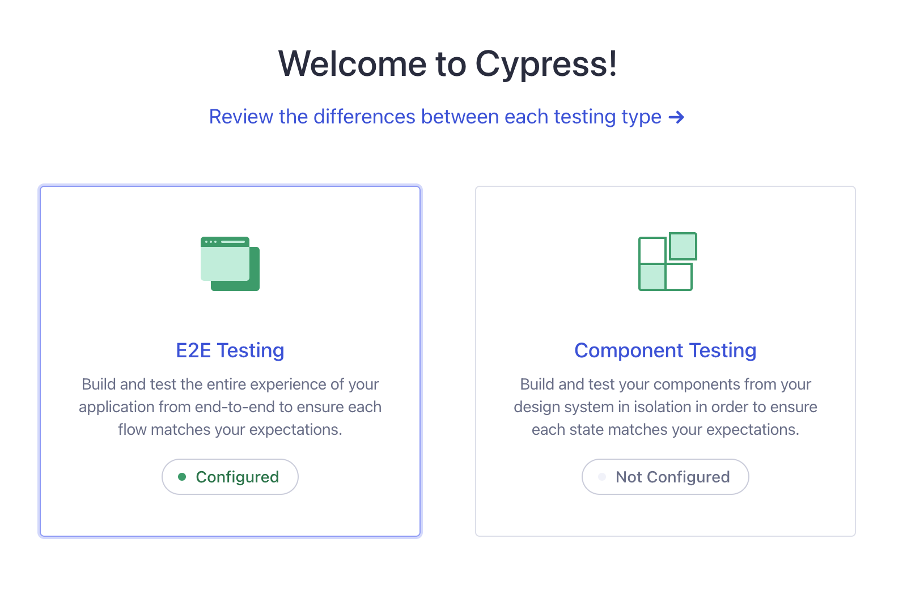
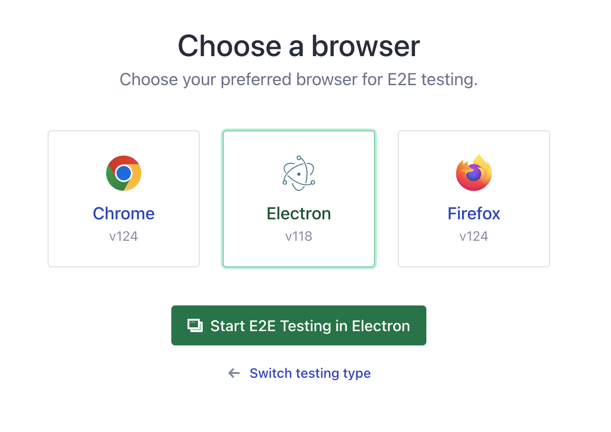
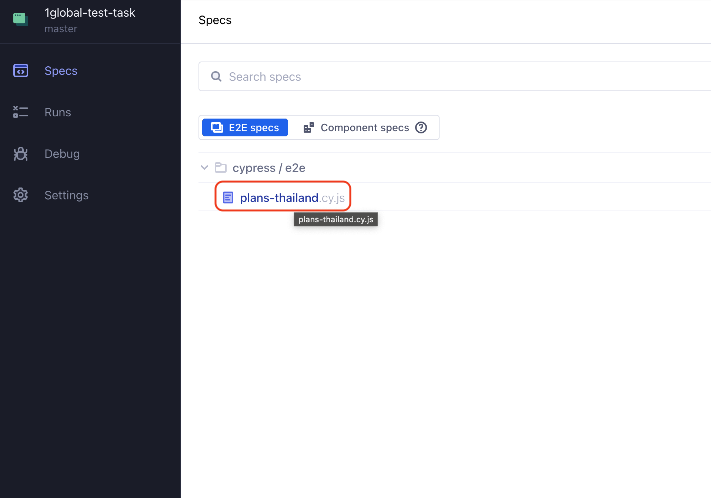
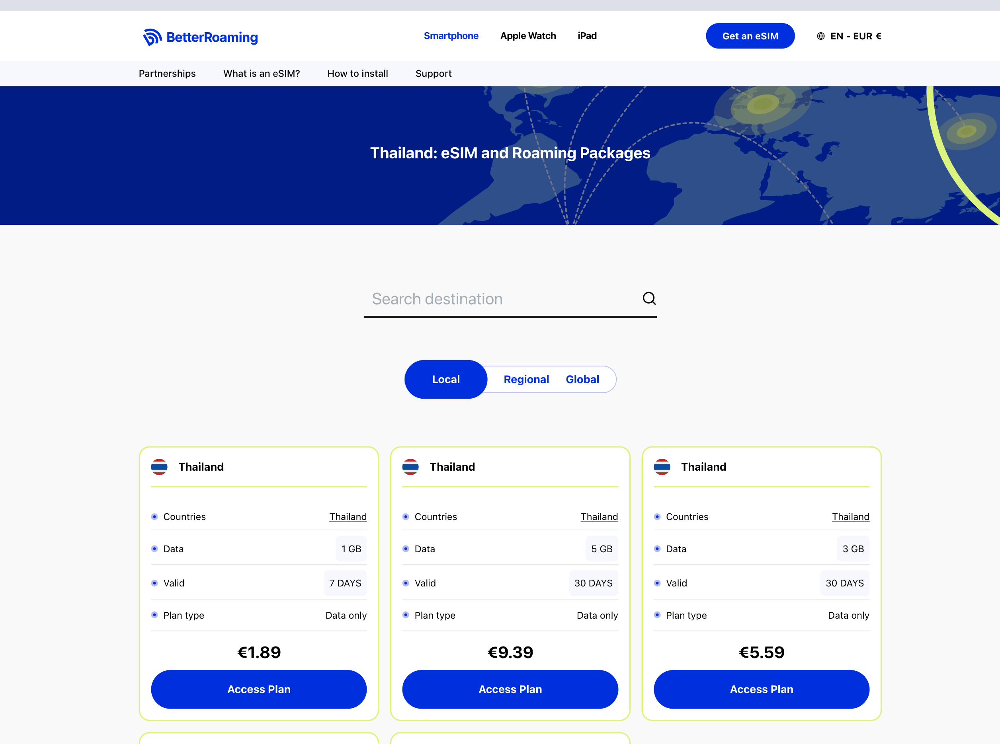

# 1global-test-task

This repository contains the solution for the 1GLOBAL QA assignment, demonstrating UI test automation on a page from the betterroaming.com website using the Cypress test framework.

## Getting Started

### Prerequisites

Ensure you have the following installed:
- [Node.js 18.x or Node.js 20.x and above](https://nodejs.org/en/download)

### Setup

Clone this repository:
```bash
git clone https://github.com/BayrakVV/1global-test-task.git
```

Navigate to the repository root to execute terminal commands:
```bash
cd path/to/repository
```

## Running Tests

### From the command line

To run the tests in headless mode, simply execute:
```bash
npm run cy:run
```

### Using the Cypress App with Browser Preview

Launch the Cypress app:
```bash
npm run cy:open
```
Click on "E2E Testing":



<br>

Choose your preferred browser and click "Start E2E Testing":



<br>

Select the plans-thailand.cy.js spec to run:



<br>

Watch your tests running in the preview window:

